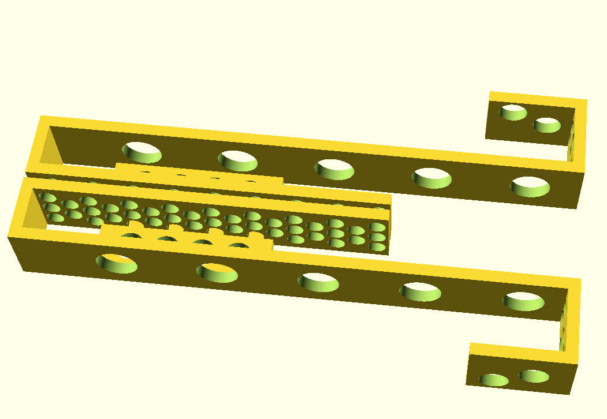

= iPad-holder

A simple bedside iPad holder.
I used it to keep my iPad during then night while sleeping.
It keeps it from falling down, easy to put the iPad into it, while almost falling to sleep.
Also, the iPad tended to flip down when I was just leaning against the side of the bed.
I did not want to lay it on the floor.
I was afraid stepping on it in the middle of the night.
Also, the holder is a place where it is protected from the dogs.

image::IMG_6277.png[]

The two sides are mirrors of each other.
You cannot just print two of the same side.
The design looks the following:

The holder is created from two pieces, and it needs extra parts to assemble.
The printed elements give the two sides of the iPad holder.
I used brass rods to hold the sides in place.
The brass rods were glued using two-component epoxy, as you can see on the photo.

If I were doing it again I would

* design small dados for the brass inserts,
* make it more "funnel like" shape, meaning:
** have the top part of the outer side be a bit wider, so that the iPad can be inserted from the top easier without looking at it.
** I would also make the sides a bit wider and getting to the size closing to the bottom.

+
These modifications would make it easier to insert the iPad from the top while being sleepy and without looking at it.

The holes in the design save material, but they are not necessary.
The top is 20mm wide, which is the standard size of the furniture panels.

The side panels have a height enough to hold the iPad in place but the same time it does not cover the charging port.